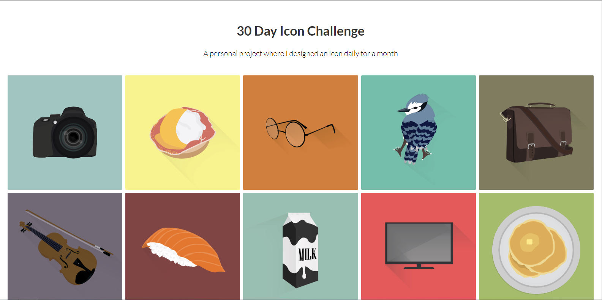

# Icon Display Site Made With React

A react site utilizing and modifying a react-lightbox-component to display my illustrations.

Live Link:  https://icon-gallery.netlify.com/  
React Gallery: https://reactjsexample.com/an-image-lightbox-component-for-reactjs/

This project was bootstrapped with [Create React App](https://github.com/facebook/create-react-app).

## Available Scripts

In the project directory, you can run:

### `npm install`

This will install the dependencies for the react app to run. 

### `npm start`

Runs the app in the development mode. 
Open [http://localhost:3000](http://localhost:3000) to view it in the browser.

